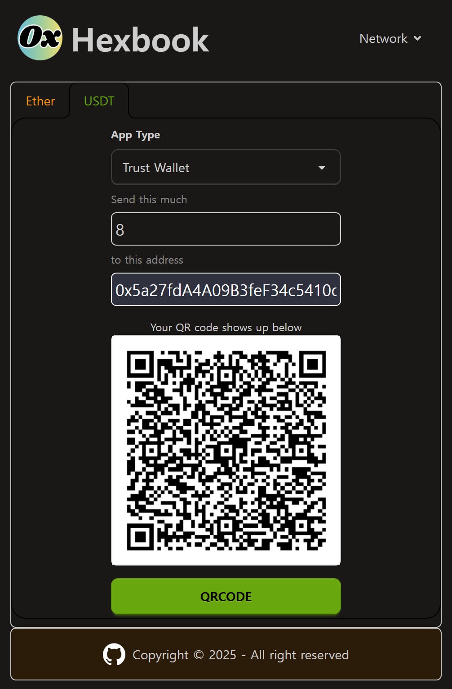

# Hexbook

Tip or get a tip with QR code.

Crypto-freindly.

## Feature

- 💸 Pick and go: Support the most popular crypto `Ether`, `USDT`
- 🔋 Batteries included: Use as it is on web
- 🔪 Battle-tested: Unit test with `testify` and Hands-on test with `Metamask`, `Trust Wallet`
- 💾 Portable and handy: Provide Docker image
- 🍰 No brainer: No complicated SPA - just 1 HTML file

## Tech stack

| Section | Details                      |
| ------- | ---------------------------- |
| Client  | `htmx`, `tailwind`, `daiyui` |
| Server  | `gin`, `swagger`             |
| Infra   | `Docker`, `docker swarm`     |

---
